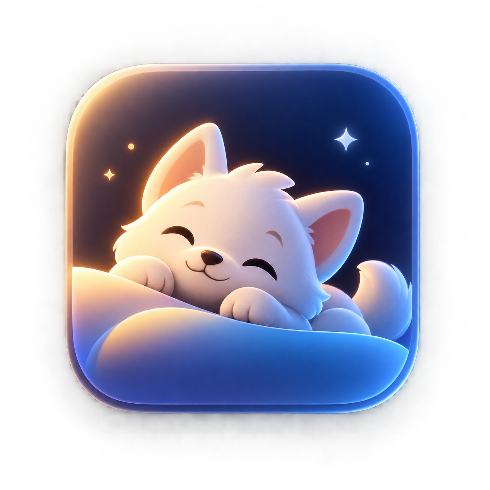
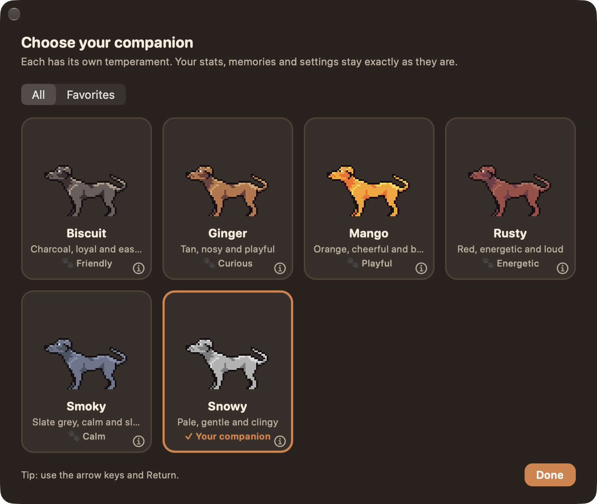

<div align="center">



# Desktop Companion

**A beautiful little companion that lives on your Mac.**

A tiny companion that wanders your desktop, naps when it's tired, notices your cursor,
follows you around, does tricks, plays hide & seek, talks to you — and helps you get things done.



</div>

## ✨ Features

- **Alive, not random** — one behavior engine with moods, energy, drives and cooldowns: it roams, sits, dozes, sleeps, wakes up, gets curious, gets bored, gets excited and sometimes gets annoyed.
- **Follow Cursor** — smooth, never teleports, respects screen edges, stops when you say so.
- **Activities** — Follow Cursor · Come Here · Play · Explore · Hide & Seek · Stay · Watch Cursor · Nap.
- **36 companions with their own temperaments** — pixel dogs, a fox, a dragon, a robot, a penguin, a cactus… each behaves differently (playfulness, curiosity, energy, affection…).
- **It talks** — hundreds of little lines: reactions to clicks and pats, mood and time-of-day chatter, comments when you pick it up, put it down or walk by. Adjustable in Settings → Talkativeness.
- **Tricks & hearts** — ask it to Sit, Lie Down, Beg, Speak, Spin or Celebrate from the menu (only the tricks its art can do); double-click for a pat and floating hearts.
- **It gets to know you** — familiarity grows over days (not by click-spamming), and shows in how often it approaches and how it greets you.
- **Dashboard, settings, onboarding** — mood, current activity, days together, favorite activity, milestones.
- **Tasks with schedules** — type tasks in plain words (“call mom tomorrow 5pm !high every week”): due dates and times, priorities, repeats (daily, weekdays, weekly, monthly), reminders before the deadline, nagging until done, snooze/reschedule, filters for open / overdue / upcoming / done.
- **Reminders that come to you** — your companion walks over and asks: [Done] [Snooze] [Dismiss]. Custom (repeating) reminders too, with optional macOS notifications.
- **Pomodoro focus** — 25·5, 50·10, 15·3 or your own plan, long breaks after each cycle, optional auto-start, a live timer on the companion, and a companion that settles down quietly beside you.
- **Wellness** — water goal, screen-break nudges based on real activity, 20-20-20 eye breaks, stretch nudges, bedtime reminder that offers to move open tasks to tomorrow.
- **Stats & streaks** — today at a glance, daily focus and water goals, a 7-day view of tasks, focus, water and screen time, a streak counter and a few plain observations (best focus day, goal days).
- **Briefs** — a morning brief (“3 tasks today, 1 overdue”) and an evening recap.
- **Tiny and local** — ~30 MB of memory, well under 1% CPU at idle, no network code at all.

## 🖥️ macOS

**macOS only.** macOS 13 (Ventura) or newer, Apple Silicon and Intel (universal app).

## 🚀 Installation

1. Download `DesktopCompanion-v1.1.0-macOS.dmg` from the [Releases](../../releases) page.
2. Open it.
3. Drag **Desktop Companion** onto **Applications**.
4. Open it from Applications.

That's it — no Terminal, no setup.

> **First launch:** the app isn't notarized by Apple (that needs a paid developer account), so macOS will
> say it can't verify it. Open **System Settings → Privacy & Security**, scroll down and click
> **Open Anyway**. You only do this once.

## 🎮 Interactions

| Do this | Get this |
|---|---|
| Click | It looks at you (or wakes up, or barks) |
| Double-click | A pat, with hearts ❤️ and a happy line |
| Click a lot | It gets excited, then annoyed. Give it a minute (a gentle pat helps) |
| Drag | Carry it anywhere, even to another display |
| Right-click / the menu-bar icon | Activities, tricks, dashboard, mode, companions, settings |
| **⌃⌥⌘F** | Follow the cursor on/off |
| **⌃⌥⌘H** | Come here |
| **⌃⌥⌘S** | Stop the current activity |
| **⌃⌥⌘D** / **⌃⌥⌘P** | Dashboard / show or hide the companion |
| **⌃⌥⌘T** | New task (quick add) |
| **⌃⌥⌘E** | Start / stop a focus session |
| **⌃⌥⌘W** | Log a glass of water |

Hide & Seek: it runs to a far corner and crouches. Move your cursor near it — or click it — to find it.

## 🧠 How it works

A single deterministic engine, `PetBrain`, picks what the companion does next from weighted options
(energy, boredom, curiosity, affection, personality, mood, time of day, cursor, cooldowns). Activities
are queued behaviors and timed windows inside that same engine — there is no second brain, and no AI
model. Movement is planned as eased legs and handed to Core Animation, so the app does almost no work
per frame.

## 🔒 Privacy

Everything stays on your Mac. There is **no network code**, no analytics, and no account. The app requires
**no macOS permissions**: no accessibility, screen recording, camera or microphone. Notification banners are
optional and only requested if you turn them on. It reads how long it's been since your last keypress or
click (to know if you're around) and — only if you turn on "step aside" or "comment on what I'm doing" —
the name of the frontmost app. Tasks, reminders and history live in local SQLite files in
`~/Library/Application Support/DesktopCompanion/`. Settings → Privacy lists everything.

## 🛠️ Development

```bash
swift build                      # debug build
swift run CoreTestsRunner        # the test suite (no Xcode needed)
./scripts/package_app.sh         # universal, ad-hoc signed release/Desktop Companion.app
./scripts/package_dmg.sh         # release/DesktopCompanion-v1.1.0-macOS.dmg
```

Layout: `Sources/Core` (engine, no AppKit) · `Sources/Platform/macOS` (windows, menus, UI) ·
`Sources/App` (wiring) · `Sources/CoreTestsRunner` (tests) · `Characters/` (art packs) · `docs/`.

## 📜 License

The code is [MIT](LICENSE) © Rohit Kumar Pulamarasetty.

The companion artwork is **not** covered by that license. The six pixel dogs are derived from
[Pixel Dogs by Benvictus](https://benvictus.itch.io/pixel-dogs); the other 30 companions come from the
OpenPets catalog. Sources, credits and caveats are in [THIRD_PARTY.md](THIRD_PARTY.md).
